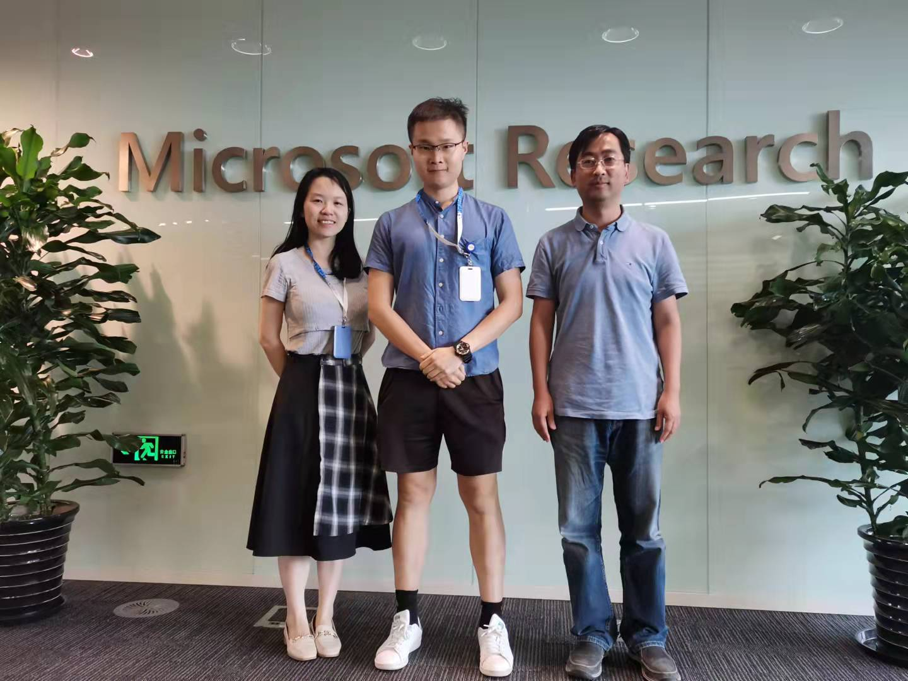

I am Yiqiao Jin (靳轶乔, "Ahren"), a 4th year undergrad at UCLA and a Computer Science major.

Currently, I am an undergraduate research assistant at Scalable Analytics Institute ([ScAi](https://scai.cs.ucla.edu/))
under the mentorship of 
[Prof. Yizhou Sun](http://web.cs.ucla.edu/~yzsun/) and 
[Prof. Wei Wang](http://web.cs.ucla.edu/~weiwang/).

During my 3rd year, I worked as a research intern at [Microsoft Research Asia (MSRA)]('https://www.microsoft.com/en-us/research/lab/microsoft-research-asia/groups/'), Social Computing Group, directed by [Dr. Xing Xie](https://scholar.google.com/citations?hl=zh-CN&user=5EQfAFIAAAAJ). 

I was mentored by [Dr. Xiting Wang](https://scholar.google.com/citations?hl=zh-CN&user=urC8meQAAAAJ) and lead a research project on Fake News Detection.

<!--  -->
